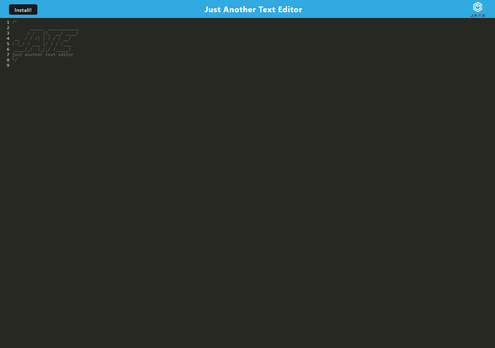

# text-editor-challenge

## Description
This challenge was designed to use our knowledge of Progressive Web Apps to build an application that functions as a text editor.

## Installation

For use by a general user, there is no installation needed. The user can just go to the website.

If you want to install the program locally:

This project uses Node.js v.16.18.0

To run the program:
1. Open the command line trerminal
2. Install the packages `npm i`
3. Run the program `npm run start`
4. Navigate to the localhost webpage

## Usage

Upon navigating to the webpage, the user will see the text editor. There is an option to install the application on the user's desktop. The user can edit their text in the space provided as they see fit, and it will be saved to the database. When they reload, or close and reopen the app, the text from the database will appear in the editor.

Here is a screenshot of the application:

Here is the link to the deployed application: [https://cryptic-mountain-94181.herokuapp.com/](https://cryptic-mountain-94181.herokuapp.com/)

## Credits

I followed the examples in the coursework of this class closely

AskBCS Learnining Assistant eroquemore177 provided assistance with line 45 of src/js/database.js (`return result?.value;`).

## License

None
